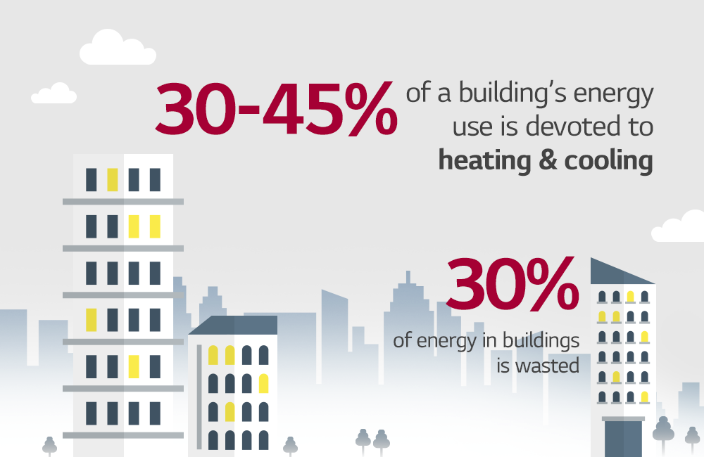
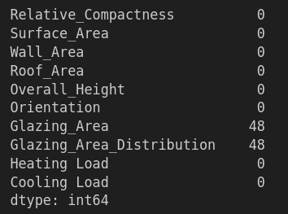
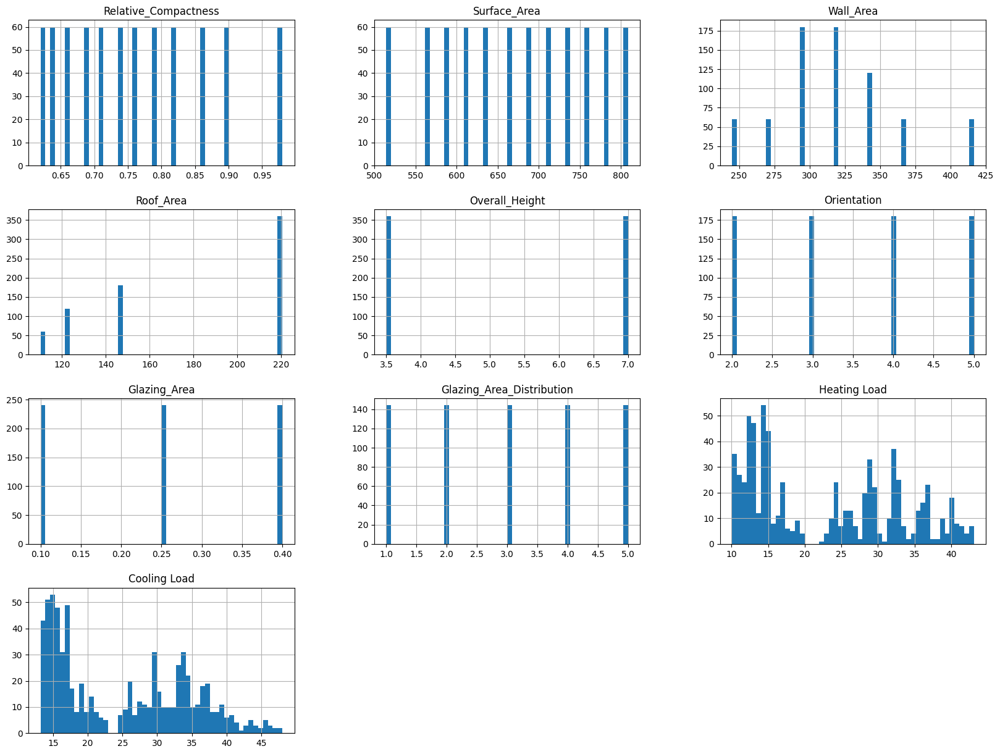
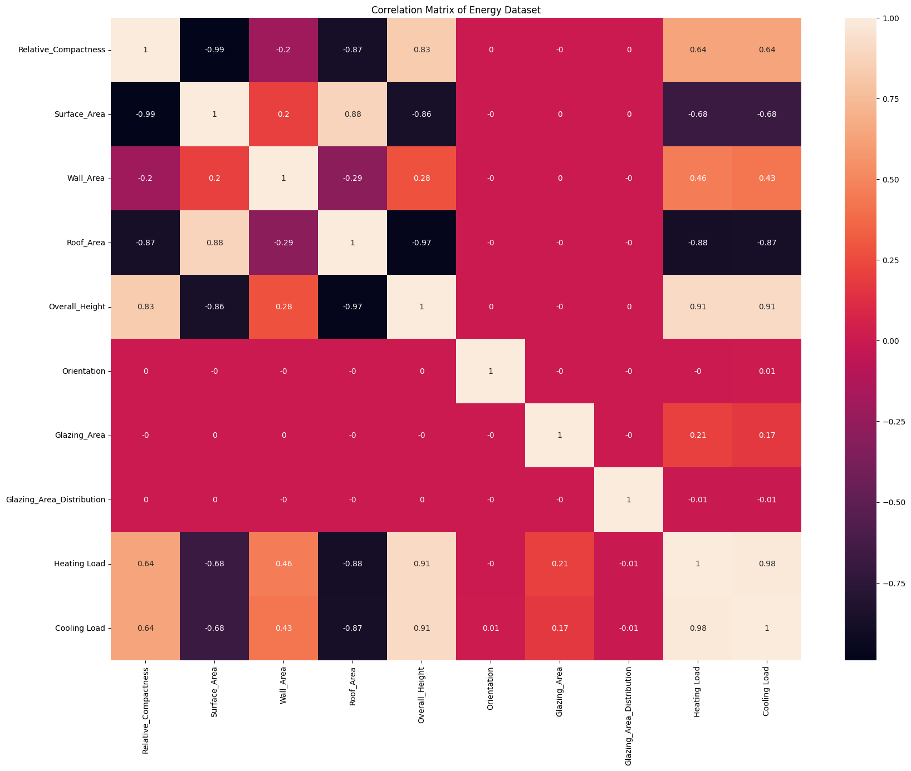
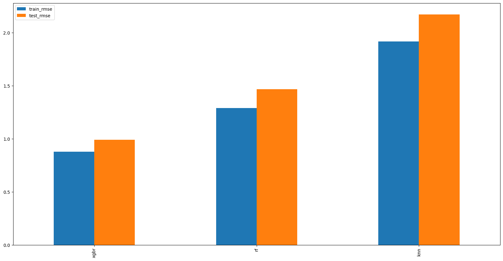

# Energy Efficiency on Building - Wildan Aziz Hida
## Project Domain

In this section, we will discuss the background related to energy efficiency in buildings. This study aims to assess the heating and cooling load requirements of buildings as a function of different building parameters. Energy efficiency is essential to reduce energy consumption and operating costs, as well as to reduce environmental impacts.

- Addressing this issue is important to help improve energy efficiency in buildings, which in turn can reduce carbon emissions.
- Use multiple machine learning models to predict the HL (Heating Load) and CL (Cooling Load) on the given component data. The model to be used is the regression model. Then - choose the model with the smallest error, some of the models to be used are:
    a. K-Nearest Neighbors
    b. Random Forest
    c. XGBoost Regressor
- Choose the model with the lowest error to be used in predicting the emergy eficiency buildings
- Examples of related references: [Machine Learning Models for the Prediction of Heating and Cooling Loads of a Residential building](https://ieeexplore.ieee.org/document/10234992) 

## Business Understanding
As previously explained, sometimes buildings like residential buildings can affect enviromental. The use of a regression machine learning model can help predict the energy of eficiency buildings before to reduce enviromental impacts. This section aims to explain the business problem and the objectives to be achieved through this project.

### Problem Statements

Describes the problem statement:
- How to predict the heating load demand of a building?
- How to predict the cooling load demand of the building?
- How to obtain a machine learning model with an error rate below 1%

### Goals

The goals of the above problem statements are:
- Predict heating loads to improve energy efficiency.
- Predicting cooling loads to optimize energy use.
- Successfully obtain a model with an error rate of less than 1%

### Solution statements
- Use EDA to understand the nature of the data and identify features that affect Heating Load and Cooling Load
- Using machine learning algorithms such as KNN, Random Forest and XGBoody to predict heating and cooling loads.
- Perform hyperparameter tuning to improve model performance and select the best model based on evaluation metrics such as **Root Mean Square Error (RMSE)**.

## Data Understanding

The dataset used in this project is obtained from [UCI Machine Learning Repository](https://archive.ics.uci.edu/ml/datasets/Energy+efficiency). This dataset contains building parameters related to energy efficiency.

### Variables in the Dataset
The following are the variables contained in the dataset and their descriptions:
- **X1**: Relative Compactness - Relative density of the building
- **X2**: Surface Area - Building surface area
- **X3**: Wall Area - The wall area of the building
- **X4**: Roof Area - The roof area of the building
- **X5**: Overall Height - Total height of the building
- **X6**: Orientation - Building orientation
- **X7**: Glazing Area
- **X8**: Glazing Area Distribution - Glazing area distribution
- **Y1**: Heating Load - Heating load (target)
- **Y2**: Cooling Load - Cooling load (target)

### Data Information
This Dataset Contains 720 samples

Remove Missing Values

In some components such as *Glazing Area*, *Glazing Area Distribution*, has contains a value of 0.
In some case, the value 0 will be considered as *missing values*.

### Data Visualization
- Univariate Analysis

Figure 1. Univariate Analysis

From the univariate analysis of the dataset, it can be seen that the two target variables, Heating Load and Cooling Load, have varying data distributions. Heating Load tends to be spread in the range of 10 to 40, with a relatively even distribution pattern, indicating significant variation between samples. 

Meanwhile, Cooling Load has a range of 15 to 45 with a distribution that is more focused on values in the middle of the range. For the predictor features, such as Relative Compactness, Surface Area, Wall Area, Roof Area, and Overall Height, it can be seen that the data distribution tends to be concentrated on certain values, indicating the discrete or categorical nature of the data. Roof Area, for example, has most of the data concentrated on a few specific categories, while Wall Area shows a more varied distribution. In addition, the Orientation, Glazing Area, and Glazing Area Distribution features are also dominated by certain discrete values. 

Overall, the characteristics of this dataset suggest that there is a possible non-linear relationship between some features and the target, so further analysis such as correlation or feature importance analysis is required to determine the influence of each feature on Heating Load and Cooling Load.

Figure 2. Correlation Matrix

From the correlation matrix shown, it can be concluded that Heating Load has a very strong positive correlation with Overall Height (correlation value of 0.91). This indicates that the taller the building, the more likely the Heating Load value will increase. In addition, there is a moderate positive correlation with Relative Compactness (0.64) and a fairly strong negative correlation with Roof Area (-0.88) and Surface Area (-0.68). This suggests that larger roof and surface areas tend to be associated with decreased Heating Load.

Features such as Wall Area show a weaker positive correlation with Heating Load (0.46), while Glazing Area and Glazing Area Distribution have very low correlations (below 0.21), indicating their influence on Heating Load is likely to be small. The Orientation variable also shows a correlation of almost zero, making it insignificant in influencing Heating Load.

In conclusion, the most influential feature on Heating Load is Overall Height, followed by Roof Area, Surface Area, and Relative Compactness. While features such as Glazing Area, Glazing Area Distribution, and Orientation do not seem to have a significant influence. This gives an initial idea of the features that need more attention in building a prediction model for Heating Load.

## Data Preparation

The data preparation steps were performed to ensure the dataset is clean, consistent, and suitable for training the machine learning model.
This steps taken in Data Preparation:

- **Data Cleaning:** Missing values are handled by imputing them with the mean or median to prevent data loss, while outliers are managed using methods like capping or removal to improve model robustness. In this project we use IQR Method by removing outliers 1.5 IQR below Q1 and 1.5 IQR above Q3.
- **Feature Scaling:** While Random Forest and XGBRegressor are tree-based models that are not sensitive to feature scaling, KNN requires normalization or standardization to ensure all features contribute equally to distance calculations.
- **Data Splitting:** The dataset is divided into training and test sets (80:20 split) to assess the model's generalization ability and avoid overfitting.

## Modeling
In this section, several machine learning models are used to predict building heating and cooling loads based on building parameters. The following are the selected models, their reasons for selection, advantages and disadvantages, and hyperparameter tuning steps.

**Pros:**
- Good at handling datasets with many features and non-linear interactions.
- Relatively resistant to overfitting on large datasets.

**Cons:**
- Can be slow and require large memory on very large datasets.
- Model interpretation is more difficult than simple models.

**Hyperparameter Tuning:**
- `n_estimators`: Determines the number of trees in the forest. Because in this dataset is small we use huge n_estimators (n_estimators: 1000)
- `max_depth`: Limits the depth of each tree to reduce overfitting.
- `min_samples_split` and `min_samples_leaf`: Controls the minimum number of samples to split a node and the minimum number of samples at each leaf node.
- `max_features`: These are the maximum number of features Random Forest is allowed to try in individual tree. In this project we use 'sqrt' which is take square root of the total number of features in individual run. For instance, if the total number of variables are 100, we can only take 10 of them in individual tree.

#### 2. XGBoost Regressor
XGBoost is a boosting algorithm that combines multiple weak models into a strong model iteratively. It is a highly efficient algorithm and is often used in data competition.

**Pros:**
- Has excellent prediction performance, especially on complex data.
- Supports regularization which helps reduce overfitting.

**Cons:**
- Requires more complex hyperparameter tuning.
- Can take more computational time compared to other models.

**Hyperparameter Tuning:**
- `learning_rate`: Controls the number of steps each tree takes in making predictions. Common values are 0.01 to 0.2.
- `n_estimators`: Specifies the number of trees in the model.
- `max_depth`, `min_child_weight`: Sets the model complexity and prevents overfitting.
- `eval_metric`: The eval_metric parameter is the metric used for monitoring performance during training and for early stopping. . For example ‘rmse’ for root mean square error. It is important to choose the appropriate metric for the problem at hand.
- `reg_lambda`: The lambda parameter is the L2 regularization term on weights. Larger values means more conservative model, it helps to reduce overfitting by adding a penalty term to the loss function.
- `reg_alpha`; The alpha parameter is the L1 regularization term on weights. Larger values means more conservative model, it helps to reduce overfitting by adding a penalty term to the loss function.
- `subsample`: The subsample parameter controls the fraction of observations used for each tree. A smaller subsample value results in smaller and less complex models, which can help prevent overfitting.
- `colsample_bytree`: The colsample_bytree parameter controls the fraction of features used for each tree. A smaller colsample_bytree value results in smaller and less complex models, which can help prevent overfitting.
- `n_jobs`: In this project we use `n_jobs = -1` it does mean Use all available CPU cores for parallel computation.
- `max_features`: The total number of unique characteristics in the dataset.

#### 3. K-Nearest Neighbors (KNN) Regressor
KNN is an algorithm that uses data proximity to predict values based on nearby data. It is simpler and works well on small data.

**Pros:**
- Easy to understand and implement.
- Does not require many assumptions about the data.

**Cons:**
- Performance may degrade on large datasets or high-dimensional data.
- Highly affected by feature scaling, thus requiring normalization or standardization.

**Hyperparameter Tuning:**
- `n_neighbors`: Specifies the number of nearest neighbors to predict values. Usually tested with different values.

### Model Selection and Improvement

Based on the model used, hyperparameter tuning is performed to improve the performance of each model. The best results are selected based on predefined evaluation metrics, namely **Root Mean Squared Error (RMSE)**.

After tuning, the **XGBoost Regressor** was selected as the best model, achieving the following performance:
- **Train RMSE:** 0.876174  
- **Test RMSE:** 0.988739  

These results indicate that XGBoost provides the best generalization performance among the models tested. The low RMSE on both the training and testing datasets suggests that the model captures the patterns in the data effectively without overfitting.

## Evaluation

The **Root Mean Squared Error (RMSE)** is used as the evaluation metric. It is implemented using the `mean_squared_error` function from `sklearn`, followed by applying the square root with `numpy.sqrt()` to calculate the RMSE value.

RMSE measures the error by squaring the difference between the true values (`y_true`) and the predicted values (`y_pred`), averaging these squared differences, and then taking the square root.

The formula for RMSE is:

Where:  
- **RMSE**: Root Mean Squared Error  
- **y**: Actual value  
- **ŷ**: Predicted value  
- **i**: Index of the data  
- **n**: Number of data points  

This metric helps in training the models and evaluating their error effectively.

The table below shows the loss for each model:

| Model | Train RMSE | Test RMSE |
|-------|------------|-----------|
| KNN   | 1.915688   | 2.169956  |
| RF    | 1.287957   | 1.465254  |
| XGR   | 0.876174   | 0.988739  |

The plot below shows the loss for each model:

The table below shows the prediction results for each model:

| Heating Load (true) | Cooling Load (true) | knn_Heating Load (pred) | knn_Cooling Load (pred) | rf_Heating Load (pred) | rf_Cooling Load (pred) | xgbr_Heating Load (pred) | xgbr_Cooling Load (pred) |
|----------------------|---------------------|--------------------------|--------------------------|-------------------------|-------------------------|--------------------------|--------------------------|
| 11.07               | 14.42              | 10.9                    | 14.4                    | 12.0                   | 15.0                   | 11.200000               | 14.300000               |
| 15.19               | 19.30              | 13.3                    | 16.1                    | 16.0                   | 19.6                   | 14.900000               | 18.900000               |
| 39.72               | 39.80              | 39.9                    | 39.6                    | 38.3                   | 38.1                   | 39.700001               | 38.700001               |
| 40.68               | 40.36              | 39.5                    | 39.1                    | 38.5                   | 38.2                   | 39.799999               | 39.000000               |
| 19.42               | 22.53              | 17.2                    | 19.0                    | 18.3                   | 21.3                   | 19.100000               | 22.100000               |
| 34.24               | 37.26              | 35.7                    | 35.8                    | 33.5                   | 34.6                   | 35.099998               | 36.500000               |
| 36.86               | 37.28              | 36.3                    | 37.2                    | 37.4                   | 37.6                   | 36.900002               | 37.099998               |
| 28.67               | 29.43              | 28.6                    | 29.7                    | 29.1                   | 30.5                   | 28.600000               | 30.000000               |
| 12.77               | 16.22              | 14.3                    | 17.5                    | 12.7                   | 15.7                   | 13.200000               | 16.000000               |
| 36.13               | 37.58              | 36.9                    | 37.1                    | 37.4                   | 37.5                   | 36.900002               | 37.099998               |

From the data, it is evident that the regression models can predict the Heating Load and Cooling Load based on the given component data. Among them, the XGBRegressor model stands out with an error rate of less than 1%, demonstrating predictions that are closely aligned with the actual values, albeit with minor discrepancies at times.

However, there is room for improvement, particularly in the modeling process. Enhancing the performance of the XGBRegressor model through hyperparameter tuning could further reduce the error, enabling more accurate predictions of the heating load and cooling load with minimal deviation.

## Conclusion
In the model evaluation, the results demonstrate that the XGBRegressor model delivers the best performance, achieving an RMSE of 0.98 on the test dataset. This suggests that the XGBRegressor can predict heating load and cooling load with an error of less than 1% of the actual values.

Other models, such as the Random Forest, also produce relatively low errors, though the KNN model shows slightly higher errors in comparison. Despite this, all the models are effective in predicting heating load and cooling load with reasonable accuracy.

This project successfully fulfills its objective of predicting heating load and cooling load using machine learning models. However, further hyperparameter tuning of the XGBRegressor could reduce errors even more, ensuring greater reliability in the predictions.

# References
##### [1] Sharad Kumar Tiwari, Jaskirat Kaur, Ramanpreet Kaur, "Predictive Modelling for Heating and Cooling Load Systems of Residential Building", 2024 https://ieeexplore.ieee.org/document/10503016/authors#authors
